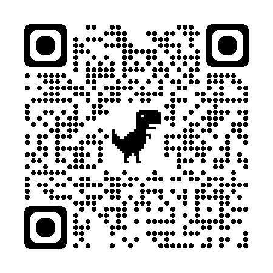

# ClackSend - Colour Encoding for IoT Device Configuration

## Introduction
This page provides a proof of concept for a simple way of encoding configuration data such that it can be read using cheap components on an IoT device

## TLDR;
[Click here to cut straight to the demo](demo.html) then click the "Writer" button on one device and the "Reader" button on another device which has a webcam. Point the first device at the camera of the second such that the 9 colour squares completely fill the camera view. The message entered on the writer device will be transmitted to the reader device.

Here is a QR code to help you quickly navigate to the demo on a mobile device...

## The Problem
IoT devices often need to connect to a WiFi network. To do this they need to know the SSID of the WiFi network and usually also a password. IoT devices often have minimal, or zero user interface (i.e. no keyboard or screen), as such it is not possible for the user to key in the details. A typical approach is for the device to start up as a WiFi access point. The user must then disconnect their mobile phone/laptop from their normal WiFi network, connect to the access point created by the IoT device, use some web interface provided by the IoT device to pass the WiFi connection details to it. The IoT device then stops being an access point and the user has to reconnect their mobile phone/laptop back to their normal WiFi network.

This is a convoluted process both for the user and for the IoT device (which needs to have all the software to operate an access point and a web server - solely for the purposes of this very infrequent process).
        
## Solution
The solution demonstrated here is to use a simple colour code to transfer the data. The user keys the WiFi SSID and password into a web page (the password need never actually leave the browser) or an app on their mobile phone/laptop. Code on the web page/app converts the configuration data into a sequence of colour flashes which are displayed on the screen. The user then holds the IoT device up to the screen which detects the colour sequence and decodes the data.

Receiving this data requires just a simple colour sensing module, or 3 photoresistors with red green and blue filters. In the case of the Raspberry Pico this comes with 3 analogue to digital converters which are ideal for this purpose.

## Demo
The demonstration provides a proof of concept for the data transmission at the heart of the process. The demo uses a webcam instead of a light sensor - although it only actually reads the colour from the single pixel at the centre of the video frame.

### Why is it so slow?
The demo is limited by the speed of javascript and also the frame rate of the camera. Using simple colour sensor electronics ought to allow for a faster data rate - although I suspect that the limiting factor would then be the refresh rate on the screen being used to display the code. Either way, even the slow data rate here - about 1 byte per second - should provide a usable mechanism for transmitting the limited amount of data required for wireless network configuration.
