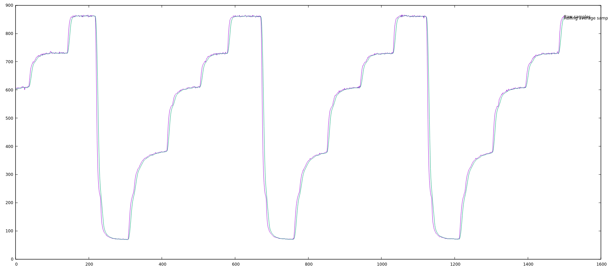
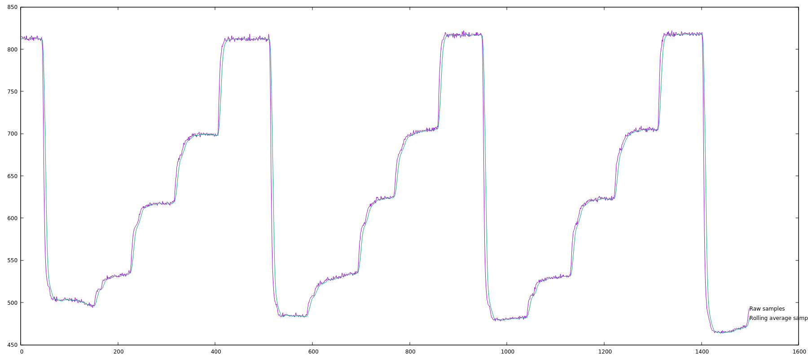
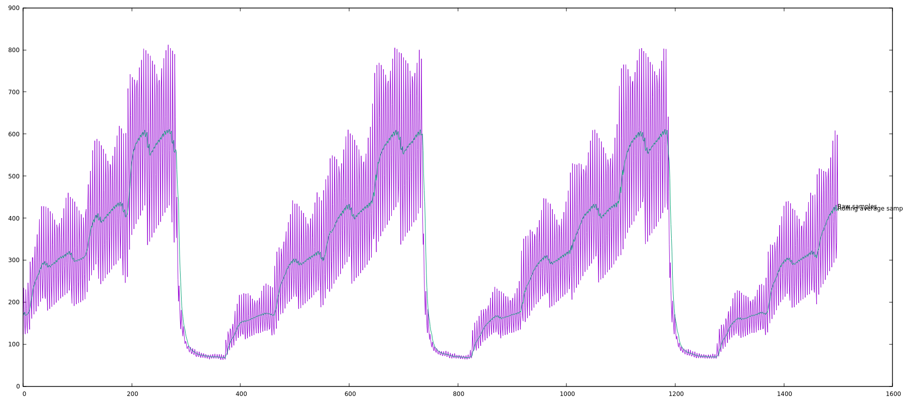
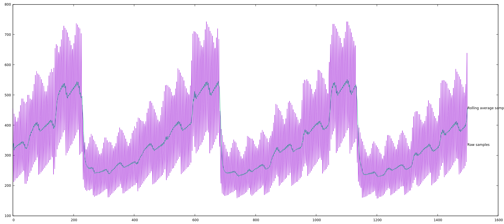
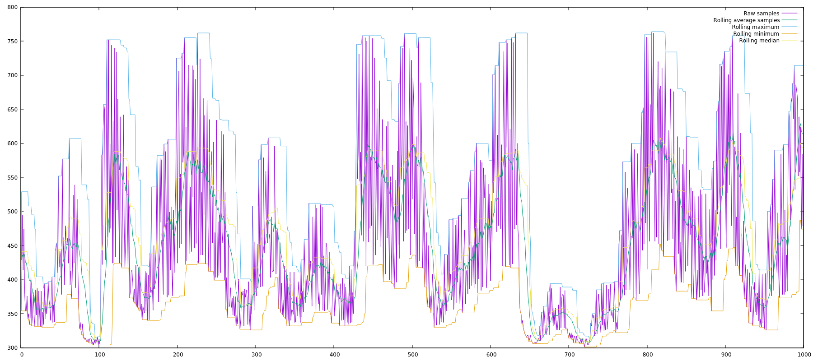
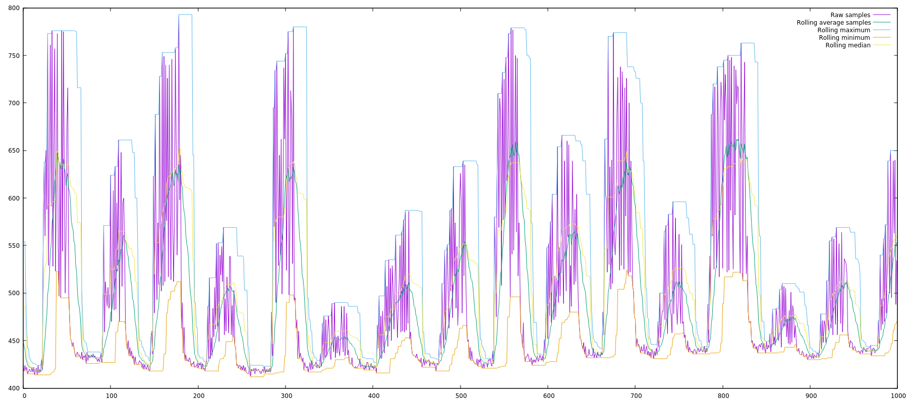

# What is Threshold Finder

Before we can extract data from the lightstream we need to be able distinguish one colour/intensity from another. My ideal outcome would be able to use a single light sensor so as not to require too many components and not tie up too many of the ADC pins on the microcontroller.

The code in this folder is what I am using to experiment with different ways of distinguishing different light intensities.

# Challenges
There are 2 main problems
1. The simple and obvious problem... the light level will change depending on how far the reader (light sensor) is from the writer (phone/laptop screen). The image below shows a graph of light level readings taken with the sensor write up against the screen...

... and this image shows how these light levels change when the sensor is further from the screen...

You can still clearly identify the steps but they are at different values.
2. *The following is my current hypothesis*... The second and more challenging problem is dealing with screen brightness. Most screens these days are backlit. That means the brightness of the screen comes from white LED's behind the screen. When you turn down the brightness of your screen all that happens is the brightness of the backlight LED's is turned down. LED's can only be on or off, so reducing the brightness involves using pulse width modulation (PWM) i.e. turning the LED on and off very quickly. This seems to cause us a problem. The graphs above were sampled at full brightness. Here is a graph taken at low brightness with the reader right up against the screen.

... The purple line is the real signal, the blue line is a rolling average. The signal appears to be extremely noisy. What I think is happening here is that we are reading the light level so quickly that some of the time we are reading the light level when the backlight LED's are switched off. If you look at the peaks of the purple lines then we are seeing a sine wave. I suspect this is due to the sampling rate and the LED flash rate being slightly out of sync. Also... if you look at the lowest level there is very little noise here - that is because this is black i.e. none of the light from the backlight LED's is being let through - hence no PWM effect. If we move the reader further from the screen then the sample gets even more messy...

The first problem I have pretty much solved and will come back to.

The second problem is tricky. The graphs above show a test sequence: 0,1,2,3,4 etc. Up to now I have been encoding the data as a sequence of different brightnesses e.g. 4,2,1,0,2,3... A real data sample at low brightness looks like this...

The clear steps are completely gone and distinguishing the levels is now very hard.

The graph above also include a rolling maximum line (pale blue) and a rolling minimum line (yellow).

Part of the problem here is the time it takes the light sensor to register the change - I think it takes it longer when the change is greater. So the shape of a 4 is different if the previous level was 3 compared to a 4 when the previous level was 0.

The behaviour of the sensor seems much more predictable if we pull it back down to zero light level between each sample...

Here we see a fairly consistent and easily distinguished shape to the data which is encoded as differing height peaks inbetween the zero periods. This is especially true if we look at the light blue line which shows the rolling maximum over 16 samples.

# Next Steps
I think the way forward is as follows:
1. Encode the data as pulses between zero's as shown above
2. Rather than looking for the step, look for the leading and trailing edge of the pulse.
3. When the leading edge of the pulse is detected then start recording samples
4. When the trailing edge of the pulse is detected then stop recording samples and look for the maximum sample encountered in that pulse (we can also record the pulse length at the same time).
5. We can now use both the level and the length of the pulse (using the zero period as a metric for pulse length).
This approach should allow us to encode 6 bits of data in a single pulse (1 bit in pulse duration, and 2 bits from pulse intensity).
BTW the pulse lenght in the graph above is 70ms.

